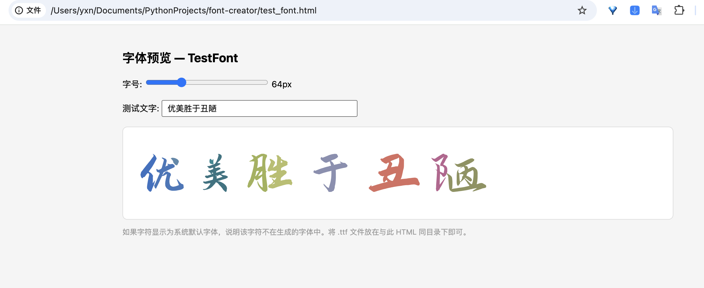

# font-creator

从 PNG 图像生成 COLR v1 彩色字体（.ttf）的命令行工具。

## 效果
利用生成的字体渲染的网页 `test_font.html`


## Pipeline

1. 生成测试图像，从字符列表读取字符（例如常用汉字、阿拉伯数字、英文大/小写字母），用已知的字体文件渲染，每个字符生成一个四通道 PNG 图像彩色图像（这里用的是渐变色渲染），每个图像文件命名为其所代表的字符（例如 a.png）。后续可将这一步替换为用生成模型生成字符图像
2. 将第一步生成的 PNG 图像用 vtracer 转换为 SVG 矢量图
3. 将 SVG 矢量图重命名为符合 nanoemoji 标准的 Unicode 格式，以方便建立字符到字体的映射关系
4. 利用 nanoemoji 从重命名的 SVG 矢量图文件构建字体文件


## requirements

```bash
pip install Pillow vtracer nanoemoji ninja numpy
```

## 用法

### 从字体渲染生成

主要用于测试能否跑通流程，先用指定字体渲染常用字，每个字保存一个 4 通道 png 图, 再用这些图 “逆向” 生成字体.
```bash
python -m creator \
  --source font \
  --font-path 演示悠然小楷.ttf \
  --characters-file  zen.txt \
  --family “MyColorZh” \
  --output MyColorZh.ttf
```
为了加速演示，这里只转换了 `zen.txt` 中字，如果想生成完整可用的字库，将 `--characters-file` 中的 `zen.txt` 替换为 `common-characters-level-1.txt`

生成的 PNG、SVG 文件分别位于 `font_build/png/` 和 `font_build/svg/` 文件夹下, 字体文件为 `font_build/build/` 下的 `.ttf` 文件. 拷贝出需要的字体文件后, 剩下的中间产物可以删掉.

### 从已有 PNG 目录生成

PNG 文件名需为单字符，如 `a.png`、`一.png`。

```bash
python -m creator \
  --source png \
  --png-dir ./font_build/png \
  --family "MyColorZh" \
  --output MyColorZh.ttf
```

## 参数

| 参数 | 默认值 | 说明 |
|------|--------|------|
| `--source` | (必填) | `font` 或 `png` |
| `--font-path` | - | 字体文件路径（source=font 时必填） |
| `--characters-file` | - | 字符文件路径（程序会自动提取文件中的字符并去重，source=font 时必填） |
| `--png-dir` | - | PNG 图像目录（source=png 时必填） |
| `--max-size` | 512 | 生成 png 时渲染的文字图像最大尺寸 |
| `--family` | MyFont | 字体 family 名, 安装完字体文件后，系统显示的字体名 |
| `--output` | MyFont.ttf | 输出 .ttf 文件名 |
| `--upem` | 1024 | units per em |
| `--ascender` | 800 | ascender |
| `--descender` | -200 | descender |
| `--color-format` | glyf_colr_1 | nanoemoji color format |
| `--work-dir` | ./font_build | 中间产物目录 |

## 项目结构

```
creator/
├── __main__.py      # 入口
├── cli.py           # 参数解析
├── render.py        # 字体 → PNG（多线程）
├── vectorize.py     # PNG → SVG（vtracer）
├── rename.py        # SVG 重命名为 emoji_u{hex}.svg
├── build_font.py    # 调用 nanoemoji 构建 .ttf
└── pipeline.py      # 串联整个流程
```
